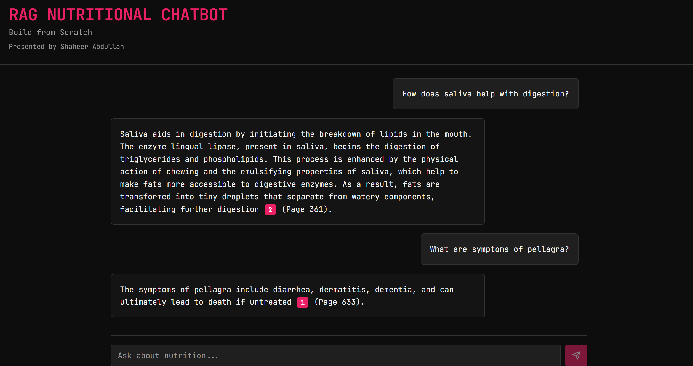

# RAG Production-Grade Implementation (Back-End + Front-End)

This repository demonstrates a **complete Production-Grade Retrieval-Augmented Generation (RAG) pipeline**.  
It includes **document preprocessing, embeddings, retrieval, Supabase integration, RAG generation, evaluation, and a frontend interface built using React + Supabase + Tailwind CSS.**

---

## 🚀 Key Features

### ✅ 1. Document Processing & Chunking
- Load PDF documents using **PyMuPDF (fitz)**
- Clean and preprocess raw text
- Implement **five advanced chunking strategies**:
  - Fixed-size chunking  
  - Recursive chunking (Sections → Newlines → Sentences)  
  - Semantic chunking using Sentence Embeddings  
  - Structure-based chunking  
  - LLM-based adaptive chunking  
- Chunk statistics: Character count, word count, token estimation

### ✅ 2. Embeddings (OpenAI + SentenceTransformer)
- Generate embeddings using:
  - Hugging Face: **all-mpnet-base-v2**
  - OpenAI Embeddings: **text-embedding-3-small (1536-dim)**
- Batch processing and GPU acceleration support
- Store embeddings locally and in **Supabase Postgres Vector DB**

### ✅ 3. Supabase Vector Store Integration (`ingest.py`)
- Upload all chunks with metadata (page, source) and embeddings
- Store using schema:
```sql
doc_id | chunk_index | content | metadata | embedding (vector[1536])
```
- Fast similarity search using **Supabase RPC function**:
```sql
SELECT match_documents(query_embedding, match_count, filter);
```

### ✅ 4. Retrieval & RAG Pipeline (`embeddings_test.py`)
- Query embedding + vector similarity search from Supabase
- Validate returned chunks (relevant content + page numbers)
- Example query output:
```bash
[1] Page 5 sim=0.923  Chunk: "Macronutrients are proteins, fats..."
```

### ✅ 5. RAG Notebook (End-to-End)
The notebook implements a full pipeline:
| Step | Description |
|------|-------------|
| 1    | Install dependencies & load PDF |
| 2    | Extract pages & statistics |
| 3    | Recursive chunking into blocks |
| 4    | Create embeddings |
| 5    | Save embeddings to CSV |
| 6    | Retrieve most similar chunks |
| 7    | Generate response with OpenAI GPT |
| 8    | Compare Dot Product vs Cosine Similarity |
| 9    | Build Prompt Formatter |
| 10   | Full RAG Query `ask()` |
| 11   | Test on nutrition dataset |
| 12   | Evaluation using **RAGAS Metrics** |

---

## 🗂 Frontend Structure (React + Vite + Supabase)

```
├── public/
├── src/
│   ├── components/      # UI components
│   ├── pages/           # Home, Search UI, RAG Chat
│   ├── utils/           # API & Supabase client
│   ├── styles/          # Tailwind CSS config
│   ├── App.tsx
│   └── main.tsx
├── tailwind.config.ts
├── supabase/           # Supabase client setup
├── package.json
├── vite.config.ts
└── .env                # Supabase credentials & OPENAI key
```

### 🎯 Frontend Features
- Upload text/PDF → Embedding pipeline
- Ask questions using **RAG Chat UI**
- Retrieve **source + page numbers + confidence score**
- Works with Supabase REST endpoints + RPC function

---

## 🧠 RAG Architecture (Backend)

```mermaid
graph TD;
    A[PDF Document] --> B[Text Extraction (fitz)];
    B --> C[Preprocessing & Cleaning];
    C --> D[Chunking Strategies];
    D --> E[Embeddings (OpenAI / HF)];
    E --> F[Supabase Vector Store];
    G[User Query] --> H[Query Embedding];
    H --> I[Vector Similarity Search];
    I --> J[Top-k Chunks];
    J --> K[Prompt Formatter];
    K --> L[OpenAI GPT-4];
    L --> M[Final Answer + Citations];
```

---

## 📦 Installation

### 1️⃣ Clone the Repository
```bash
git clone https://github.com/<your-username>/RAG-Production-Ready
cd RAG-Production-Ready
```

### 2️⃣ Backend Setup
```bash
pip install -r requirements.txt
# or for notebook:
pip install PyMuPDF supabase openai sentence-transformers ragas
```

### 3️⃣ Configure Environment (`.env`)
```
SUPABASE_URL=your-url
SUPABASE_SERVICE_ROLE_KEY=your-key
OPENAI_API_KEY=your-openai-key
```

### 4️⃣ Run Ingestion
```bash
python ingest.py
```

### 5️⃣ Test Embedding Search
```bash
python embeddings_test.py
```

---

## ✅ Future Enhancements (Planned)
- 🔹 Add API using FastAPI for RAG backend  
- 🔹 Enable multi-document support with doc_id filtering  
- 🔹 Convert into a microservice architecture  
- 🔹 Deploy frontend on Vercel + Backend on Docker + Render/EC2  
- 🔹 Add Chat History + Authentication  

---

## 🏁 Final Notes
✔ This README merges both:
- Notebook-style RAG implementation  
- Production pipeline with Supabase Vector DB  
✔ Frontend + Backend are fully modular  
✔ Embeddings stored & queried using Supabase  

---

## 📄 License
MIT License – Free to modify & use.

---

💡 **Need help deploying this on AWS / Vercel / Docker? Just ask!**

Here is a preview of the RAG interface:

